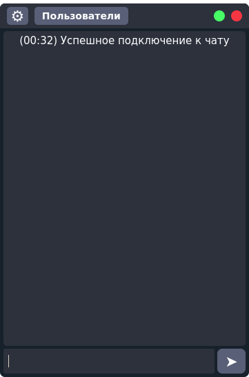

# Messenger
Messenger with a simple interface, written on the basis of the socket library
____

### Install everything you need and run
#### Installation
```
pip3 install -r requirements.txt
```
In the file `data/data_config.json` specifies the ip and port, and the same ip and port are specified in the code on which the program will run. And in the file `data/config.json` specifies user data name, number, country
#### Run
##### Running the server code
```
python3 ./server.py
```
##### Run the client code
```
python3 ./client.py
```


### Additionally
A `chat.service` file was also created to run this bot on the server
